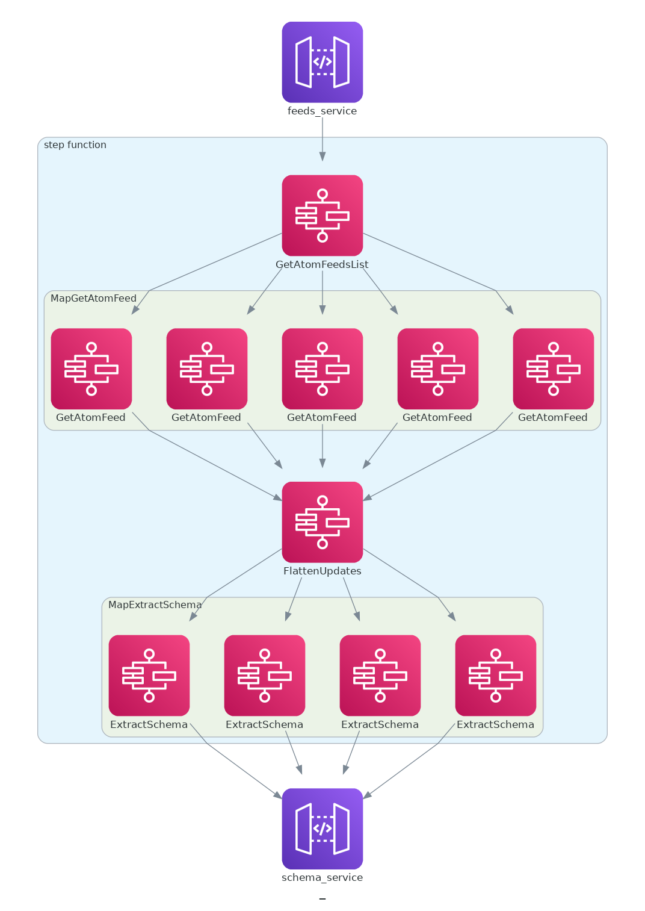

# Data Processing

Process schema versions for listed Terraform Providers

## Test

Install [`Taskfile`](https://taskfile.dev)

```sh
task test         # Tests core library for all lambdas
task test --watch # Automatically run tests on *.go file changes
```

## Build

```sh
task build # Builds all lambdas and zips them for deployment
```

## Deploy

> _**Todo**: Not all resources are configured yet_

```sh
terraform init # no remote state yet
terraform plan -out tfplan
terraform apply tfplan
```

## Step Function flow


